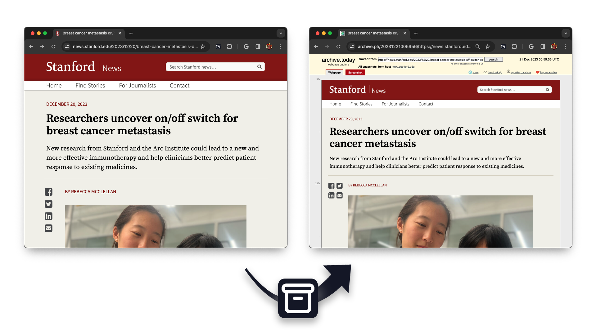

# Retrieve Today

A simple chrome extension to open the archived version of a website from the service [archive.today](https://archive.today/). Once you're on a page that you want to see the archive of, you're able to click the extension icon and the current tab will be replaced with the archived site. This respects your current history, meaning that you can just press the normal back button in chrome to go back to the original version of the site. If there isn't an archived version of the site available, archive.today will ask if you want to refine the URL, create an archive of the site, or search for the site on other archive services.

This extension is not yet on the [Chrome Web Store](https://chrome.google.com/webstore), but you're still able to install it manually. First, download the code from this repository using `git clone` or by downloading it from the GitHub website using the green "code" button at the top. Then visit `chrome://extensions` and toggle "Developer mode" in the top right. Finally, click on "Load unpacked" and select the folder containing the code you previously downloaded. I'd recommend also pinning the extension so that you're able to access it quickly.
